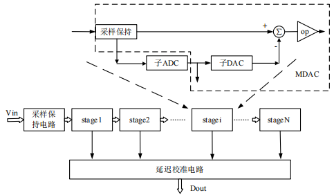
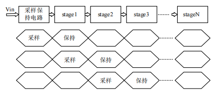
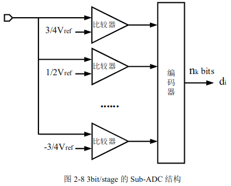
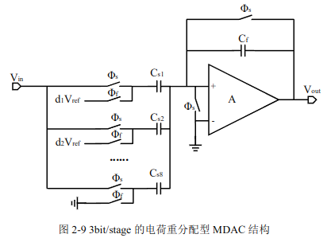
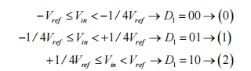
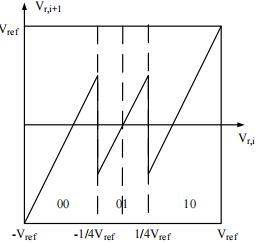
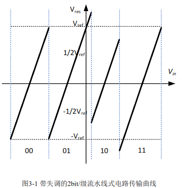
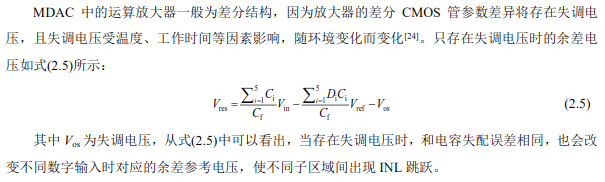
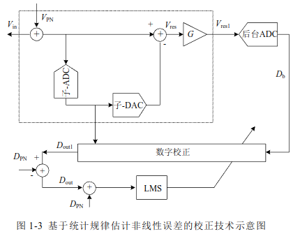

# ADC校准初步调研

**孙皓宇 2025.03**

## 一、基础概念

ADC（模数转换器）是将模拟信号转换为数字信号的电子元件，广泛应用于电子测量、通信、控制系统等领域。以下是ADC的原理、内部结构及工作流程的详细介绍：

### 1.1 ADC原理

- **采样定理**：根据奈奎斯特定理，采样频率至少要是信号最高频率的两倍，才能保证信号被准确还原。这是ADC工作的基础，确保模拟信号在采样后能够被完整地保留下来。
- **量化与编码**：采样得到的信号幅度被划分到最近的量化级，这个过程称为量化。量化后的信号幅度被转换为对应的数字代码，即编码，最终得到数字信号。

### 1.2 ADC内部结构

- **采样保持电路（SH）**：在ADC转换过程中，采样保持电路负责在特定时刻捕获并保持输入模拟信号的瞬时值，为后续的量化处理提供稳定的信号。
- **编码器**：将量化后的信号幅度转换为对应的数字代码。编码器的位数决定了ADC的分辨率，常见的有8位、10位、12位等。
- **时钟电路**：为ADC提供精确的时钟信号，控制采样和转换过程的同步进行，确保转换的准确性和稳定性。
- **参考电压源**：提供ADC转换所需的参考电压，输入信号的量化范围由参考电压决定。参考电压的稳定性和精度直接影响ADC的转换精度。

### 1.3 ADC工作流程

- **采样阶段**：在时钟信号的控制下，采样保持电路对输入的模拟信号进行采样，捕获信号的瞬时值。
- **保持阶段**：采样结束后，采样保持电路进入保持状态，将采样得到的信号幅度保持稳定，为后续的量化处理做准备。
- **量化阶段**：编码器根据采样得到的信号幅度和参考电压，将信号幅度量化到最近的量化级。
- **编码阶段**：量化后的信号幅度被转换为对应的数字代码，得到最终的数字信号输出。

### 1.4 常见ADC类型

- **逐次逼近型ADC（SAR ADC）**：通过逐次逼近寄存器控制的比较器和数模转换器，逐步逼近输入信号的量化值。具有较高的转换精度和速度，适用于中等性能要求的应用。
- **闪速ADC（Flash ADC）**：利用多个比较器并行工作，对输入信号进行快速量化。具有极高的转换速度，但电路复杂度和功耗较高，适用于高速信号处理场景。
- **Σ-Δ型ADC**：通过过采样和噪声整形技术，将量化噪声推向高频段，再通过数字滤波器滤除高频噪声，实现高分辨率的信号转换。具有高分辨率和高精度的特点，适用于低频信号测量和音频处理等领域。

### 1.5 总结

ADC作为模拟信号与数字信号之间的桥梁，其原理基于采样定理、量化和编码过程。内部结构包括采样保持电路、编码器、时钟电路和参考电压源等关键部件，协同完成模数转换任务。工作流程涵盖采样、保持、量化和编码四个阶段，不同类型的ADC根据其结构和工作原理，在速度、精度和应用场景上各有特点。

 

## 二、流水线型ADC

流水线型ADC（Pipeline ADC）是一种高性能的模数转换器，广泛应用于高速数据采集系统、通信系统、雷达等领域。以下是流水线型ADC的详细介绍

### 2.1 原理

流水线型ADC的核心思想是将模数转换过程分解为多个阶段，每个阶段完成一部分转换任务，类似于工厂的流水线生产。每个阶段通常包括采样保持电路、低分辨率的子ADC、数模转换器（DAC）、减法器和余差放大器等模块。输入信号在每个阶段被采样、量化，并将量化结果转换为模拟信号后与原始信号相减，得到残差信号，该残差信号被放大后传递给下一个阶段进行进一步处理。最终，各级的数字输出被组合起来，形成最终的高分辨率数字信号。

### 2.2 工作流程

1. **采样和保持**：输入的模拟信号首先被采样保持电路采样并保持稳定，为后续的量化处理做准备。
2. **量化和转换**：在每个流水线阶段，采样后的信号被低分辨率的子ADC量化，得到部分数字输出。同时，该数字输出通过DAC转换为模拟信号，并与原始信号相减，得到残差信号。
3. **放大和传递**：残差信号被放大后传递给下一个流水线阶段，重复上述的采样、量化和转换过程。
4. **数字输出组合**：各级的数字输出在数字域中进行组合，形成最终的高分辨率数字信号。

   

### 2.3 内部结构

流水线型ADC的内部结构主要包括：

- **采样保持电路（S&H）**：负责对输入的模拟信号进行采样和保持，确保信号在转换过程中稳定。
- **子ADC**：每个流水线阶段中的低分辨率ADC，通常采用闪速ADC（Flash ADC）结构，用于快速量化输入信号。` `
  
- **MDAC（多级动态放大器和比较器）**：包括DAC、减法器和余差放大器，用于将子ADC的数字输出转换为模拟信号并与原始信号相减，得到放大后的残差信号。` `
  
- **数字校正模块**：用于对各级的数字输出进行延迟校正和组合，以得到最终的高分辨率数字信号。

### 2.4 优点

- **高速转换**：流水线型ADC能够实现高速的模数转换，适用于高速信号处理的应用场景。
- **可扩展性**：通过增加流水线阶段的数量，可以提高ADC的分辨率。
- **高分辨率**：能够实现较高的分辨率，满足对信号精度要求较高的应用。

### 2.5 缺点

- **复杂度高**：内部结构复杂，设计和实现难度较大。
- **功耗较高**：由于多级电路同时工作，功耗相对较高。
- **流水线延迟**：存在一定的流水线延迟，影响实时性。

### 2.6 应用场景

- **高速数据采集**：如高速示波器、数字信号处理系统等。
- **通信系统**：在5G通信、光纤通信等高速通信系统中用于信号的模数转换。
- **雷达系统**：用于雷达信号的高速采集和处理。

### 2.7 1.5位子级流水线

 

## 三、性能指标

在评价ADC性能时，主要从静态指标和动态指标两方面来看。静态指标关注转换精度，即实际与理想输出之间的偏差，静态指标显示在不变环境中的量化准确性，反映线性度。而动态指标重视ADC在变化信号下的表现，如频谱特性，动态指标评估信号变化时的性能，包括噪声和失真影响，这在通信领域尤为重要。性能衡量需结合应用需求，这些指标共同确定ADC 是否适合其应用场景，确保其在各种条件下的有效运作。

### 3.1 静态性能指标

静态性能参数主要包括分辨率、增益误差、直流失调(  offset  ) 、微分非线性( Differential Nonlinearity，DNL )和积分非线性( Integral Nonlinearity，INL) 等，这里不做详细介绍。

### 3.2 动态性能指标

模数转换器（ADC）在直流或低频输入条件下的转换误差可以通过静态性能指标有效地展现。然而，随着输入信号频率的上升，特别是在达到较高工作频率时，这些参数便不足以全面反映ADC的性能。因此，为了准确描述ADC在高频条件下的性能，我们有必要引入动态性能指标。为了更加深入地了解ADC在高频下的表现，我们首先要对其数字输出进行快速傅里叶变换（FFT），以获取输出的频谱分布。接着，通过分析频谱中的基频、各类谐波以及噪声等频谱信息，我们能够全面评估ADC的高频特性，从而对其性能有更完整和深入的了解。

动态性能指标主要包括信噪失真比(SNDR)，信噪比(SNR)，无杂散动态范围(SFDR)，总谐波失真(THD)，有效位数(ENOB)等，我们重点介绍SFDR。

#### 3.2.1 SFDR的定义

SFDR（Spurious-Free Dynamic Range）即无杂散动态范围，用于衡量数据转换器（如ADC）在杂散分量干扰基本信号或导致基本信号失真之前可用的动态范围。它定义为基本正弦波信号均方根（RMS）值与从0Hz（DC）到二分之一数据转换器采样速率（如fs/2）范围内测得的输出峰值杂散信号均方根值之比。SFDR通常以分贝（dB）为单位表示，计算公式为：

$$
SFDR = 10 \log_{10} \left( \frac{\text{Maximum Output Signal Power}}{\text{Total Spurious Power}} \right)
$$

其中，“Maximum Output Signal Power”代表系统输出的最大有用信号功率，“Total Spurious Power”为所有杂散信号（如谐波、噪声等）的总功率。

#### 3.2.2 SFDR的影响因素

- **ADC的非线性**：ADC的非线性误差会导致信号的谐波失真和互调失真，从而产生杂散信号，影响SFDR。
- **时钟抖动**：时钟信号的抖动会影响ADC的采样精度，导致信号的频谱扩展和杂散增加，进而降低SFDR。
- **参考电压的稳定性**：参考电压的波动会影响ADC的量化精度，进而影响SFDR。

#### 3.2.3 SFDR的应用场景

- **通信系统**：在通信系统中，SFDR是一个十分重要的指标，因为它代表了能从一个较大的干扰信号（如阻塞器）中区分出的最小信号。例如，在接收器设计中，高SFDR的ADC能够更好地处理带内小信号和大阻塞信号同时存在的情况，避免杂散信号对有用信号的干扰。
- **雷达系统**：雷达系统需要高SFDR的ADC来准确检测微弱的目标回波信号，同时抑制强杂散信号的干扰，如雷达发射机的泄漏信号等。
- **仪器仪表**：在电子测量领域，如频谱分析仪、示波器等仪器中，SFDR决定了仪器能够准确测量信号的动态范围。

#### 3.2.4 SFDR的重要性

- **系统性能评估**：SFDR是评估系统非线性失真程度的重要指标，高SFDR表示系统输出中的有用信号相对于杂散信号更为突出。
- **信号质量保证**：通过监测和优化SFDR，可以提高系统的信号传输质量，减少干扰和失真，保障数据的准确性和稳定性。
- **设计和优化指导**：SFDR指标为工程师提供了衡量信号传输质量的标尺，在通信系统的构建中，SFDR是衡量信号有效传输空间的关键指标。

#### 3.2.5 SFDR和ADC线性度

提高ADC的线性度和提高SFDR（无杂散动态范围）性能是相关但不完全相同的概念。它们都是衡量ADC性能的重要指标，但在具体含义和关注点上有所不同。

##### 3.2.5.1 提高ADC的线性度

ADC的线性度是指其输出的数字信号与输入的模拟信号之间呈线性关系的程度。理想情况下，ADC的输出应与输入信号成正比，但由于实际ADC存在非线性误差，如差分非线性（DNL）和积分非线性（INL），会导致输出与输入之间的偏差。提高线性度意味着减少这些非线性误差，使ADC的输出更接近理想线性关系。

提高线性度的方法包括：

- **硬件校准**：通过调整ADC的内部电路参数或添加外部校准电路来补偿非线性误差。
- **算法校正**：在数字域采用校正算法，如多项式拟合、分段线性校正等，对ADC的输出进行处理，以减少非线性失真。
- **电路设计优化**：改进ADC的前端电路设计，减少由于电路特性引起的非线性误差。

##### 3.2.5.2 提高SFDR性能

SFDR主要关注ADC输出信号中的杂散信号（如谐波失真、互调失真等）相对于主信号的功率比。提高SFDR性能意味着减少这些杂散信号的幅度，从而增加主信号与最大杂散信号之间的功率比。

提高SFDR性能的方法包括：

- **减少非线性失真**：通过提高ADC的线性度来减少谐波失真和互调失真等非线性失真产生的杂散信号。
- **抑制噪声**：优化ADC的参考电压源、时钟电路等，减少噪声对ADC输出的影响，从而降低杂散信号的幅度。
- **滤波技术**：在模拟或数字域采用滤波器，滤除特定频段的杂散信号，提高SFDR。

##### 3.2.5.3 两者的关系

虽然提高ADC的线性度和提高SFDR性能是两个不同的目标，但它们之间存在密切的联系。提高线性度可以减少非线性失真，从而降低由这些失真产生的杂散信号的幅度，进而有助于提高SFDR性能。因此，在实际的ADC设计和应用中，提高线性度往往是提高SFDR性能的一个重要手段。同时，其他措施如噪声抑制和滤波等也可以进一步提升SFDR性能。

 

## 四、误差分析

### 4.1 比较器失调误差和孔径误差

* 孔径误差是指MDAC与sub-ADC的采样路径不匹配带来误差，表现为比较器采样得到的电压与MDAC采样得到的电压之间存在误差，可以用公式表示为：、

$$
∆X=2π𝑓_{𝑖𝑛}𝐴∆𝑡
$$

    其中$𝑓_{𝑖𝑛}$为输入频率，𝐴为输入信号幅度，∆𝑡为等效采样失配时间。

- 比较器失调是指比较器本身的翻转电平发生偏移，主要由两部分原因引起：
  - 一部分是因为参考电压偏离理想值，由于电阻串在制造工艺下存在失配，进而使得通过分压得到的参考电压存在误差，使得比较器翻转电压偏移，此外参考电压受外界或者其他模块影响存在波动，也导致了参考电压偏离。
  - 另一部分导致比较器性能受到影响的原因是其内部存在的失配现象。这种失配可能源于比较器内部组件的不匹配，或者是由于比较器输入电压的波动。这些因素共同作用，导致比较器本身的翻转电平发生偏移。

* 导致的结果就是实际残差电压与理想残差电压存在误差

由于子ADC大多为多位冗余设计，比较器轻微失调一般不会导致ADC误差。

### 4.2 运放误差

- 运放有限增益误差：运算放大器的增益是有限的，而有限的增益会导致信号在放大过程中产生失真，并导致MDAC各段传输曲线的斜率发生变化。满足一定精度就行。
- 运放的有限带宽
- 运放的非线性误差

运放误差后面不好校准，在设计运放的时候尽量精度高一些，满足要求就行了。

### 4.3 DAC 非线性误差（电路复杂，具体原理尚未搞懂）

- 采样电容失配（电容失配误差）
- 基准电压偏移误差
- 失调电压

  
- 码字相关的电荷注入

### 4.4 采保电路

- 电荷注入与时钟馈通
- 采保电路误差
- 采样时间的不确定性
- 时钟抖动误差：时钟抖动是指时钟信号的实际边缘与理想边缘之间的时间偏差，它会导致采样点偏离理论上的最佳采样位置，因此会导致采样得到的信号值与实际信号值之间存在偏差。
- 热噪声
  - 闪烁噪声主要来源于半导体材料表面状态的变化，其功率谱密度与频率成反比。这意味着在低频时，闪烁噪声的影响较大；而在高频时，其影响逐渐减小，以至于在高频电路中，闪烁噪声所占的比例通常可以忽略不计。
  - 相比之下，热噪声则是由导体中电子的随机热运动引起的，其功率谱密度在宽频带内近似为常数。因此，对于大多数高频和高速集成电路，热噪声是主要的噪声来源。

 

## 五、校准方法概述

流水线型ADC的SFDR（无杂散动态范围）是指在ADC的输出频谱中，主信号与最大杂散信号之间的功率比。SFDR是衡量ADC性能的重要指标之一，它反映了ADC在处理信号时对杂散信号的抑制能力。在流水线型ADC中，SFDR的性能受到多种因素的影响，包括ADC的非线性误差、时钟抖动、参考电压的稳定性等。

### 4.1 全带宽校准方法

全带宽校准的目的是在整个工作频带上对ADC进行校准，以提高其线性度和SFDR性能。常见的全带宽校准方法包括：

- **基于统计规律的校正技术**

    

- **基于测试信号的校准**：在ADC的输入端注入已知频率和幅度的测试信号，覆盖整个工作频带。通过测量ADC的输出响应，建立输入信号与输出响应之间的关系模型，然后根据该模型对实际信号进行校准。这种方法可以有效补偿ADC的非线性误差和幅相误差，提高全带宽内的性能。
- **多点校正参数估计与插值**：在工作频带内选择多个校正频点，分别注入对应的单频测试信号，估计出各频点处的校正参数。然后利用插值算法（如拉格朗日插值）对各频点间的校正参数进行曲线拟合，得到整个频带内的校正参数分布，从而实现全带宽的校准。

### 4.2 窄带校准方法

窄带校准主要针对特定的窄带信号进行优化，以提高ADC在该频带内的性能。窄带校准方法通常包括：

- **基于数字信号处理的校准**：在数字域对ADC的输出信号进行处理，如数字滤波、频域补偿等，以消除或减少特定频段内的噪声和干扰，从而提升SFDR。例如，可以设计一个带通滤波器，仅允许目标频段的信号通过，抑制其他频段的杂散信号。
- **查找表法**：建立一个查找表，将ADC的输出值与对应的校准值进行映射。通过预先测量或计算得到查找表中的数据，然后在实际应用中根据ADC的输出值查找对应的校准值，从而实现窄带校准。这种方法简单直接，但在处理宽动态范围信号时需要较大的存储空间。
- **分段线性逼近法**：将ADC的输入输出特性曲线划分为多个线性段，每个线性段用一个线性函数来近似。通过确定每个线性段的斜率和截距，可以在数字域对ADC的输出进行分段补偿，从而实现窄带校准。这种方法在计算复杂度和存储需求之间取得了一定的平衡。

通过以上全带宽校准和窄带校准方法，可以有效提升流水线型ADC的SFDR性能，满足不同应用场景对ADC性能的要求。
