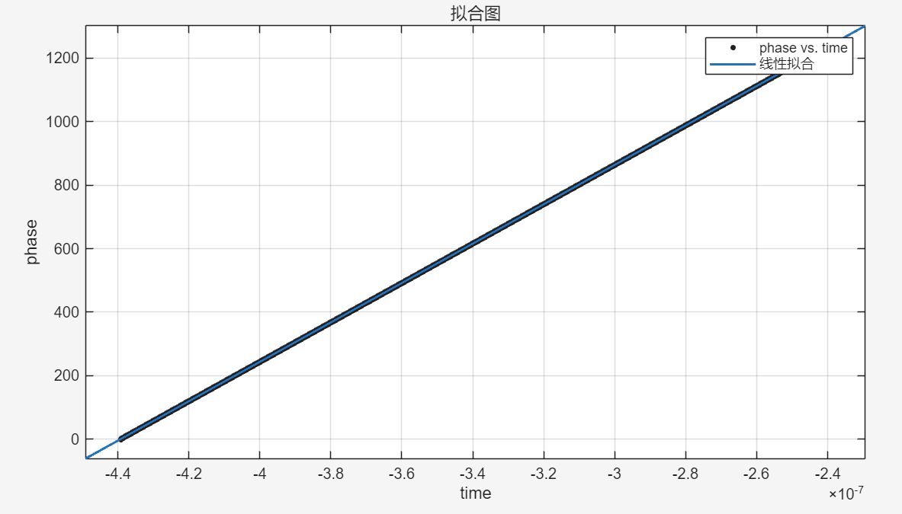

# DSIP-ADC窄带SFDR补偿

## 〇、前言

>  
> 
> - 我们认为 **ADC时钟抖动** 导致的 **采样时钟不均匀** 是导致其窄带 SFDR 不好的主要原因（真相是否是这样还需进一步考证）。
> - 将一个点频信号灌入 AD 进行采集，在确保信号源没有问题以及 AD 正常采集的前提下，通过 FIR 滤波将 **远端谐波** ，杂散滤除，之后通过 **希尔伯特变换** 将信号转换到复数域，提取其 **相位例程** ，**线性拟合** 并计算 **残差** ，多次测量，观察相位残差的规律（包括误差形貌，误差是否可重复）。
> - 根据相位残差的规律进行 **补偿** ，看其窄带的 SDFR 有没有改善
> 
>  

## 一、信号源质量测试

 

**拟合优度**
|指标|          值    |
|:-:|:-:|
|SSE|         17.5925|
|R 方|        1.0000 |
|DFE|        15983  |
|调整 R 方|    1.0000| 
|RMSE|        0.0332| 

 

## 二、ADC采样时钟稳定度测试

 

## 三、相位残差曲线

- 成夹杂随机噪声的类正弦状，峰值时变，周期是否时变尚不清楚
- 正弦峰值和随机跳变幅度都与频率有关
- 

 

## 四、结论

>  
> 
> - 相位残差曲线是有一定规律的，成夹杂随机噪声的类正弦状
> - 正弦峰值和随机跳变幅度都与频率有关
> - 峰值时变，周期是否时变尚不清楚
> - 补偿回去有效果，说明ADC时钟抖动导致的采样时钟不均匀确实是导致其窄带 SFDR 不好的一个原因
> - FPGA主频太低，无法对AD采样的数据进行实时补偿处理，即使是把误差建模成类正弦写进BRAM，也需要初相位对齐，这一点FPGA都难以实现
>  

 

## 五、下一步计划

>  
> 
> - 继续调研 ADC 窄带 SFDR 不好的主要原因，除了时钟抖动还有什么
> - 研究如何进行初相位对齐
> - 确定相位残差曲线的周期是否时变（估计是由于器件电学特性导致的周期性扰动，周期应该不时变），若不时变的话就可以将误差建模成类正弦进行补偿（峰值时变暂不考虑，先把趋势搞对），看看有没有效果
> 
>  
