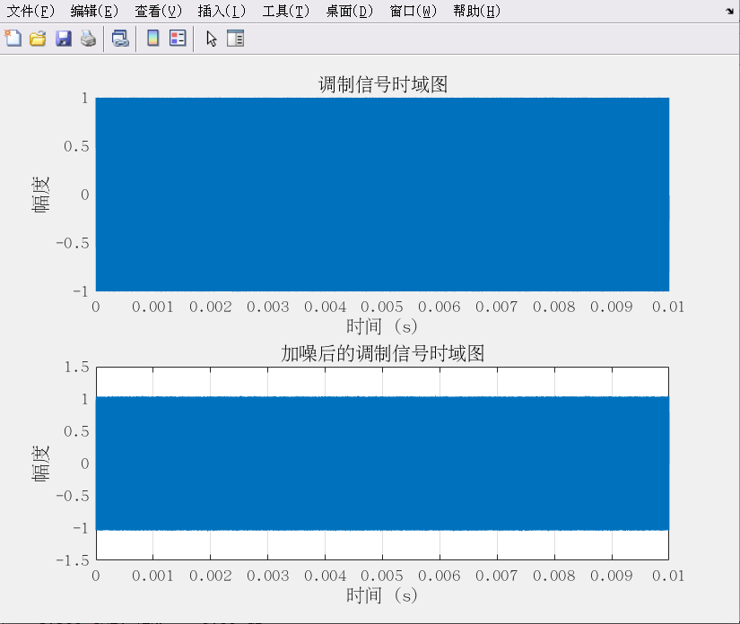
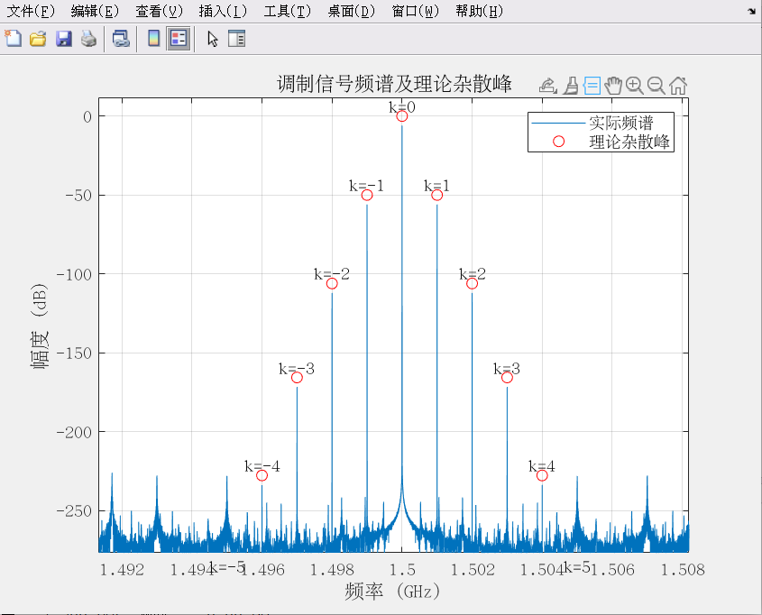

# 实验报告：基于贝塞尔函数的采样时间抖动仿真分析

---

## 一、实验目的

1. 验证周期性采样时间抖动对高频信号频谱的影响规律
2. 通过贝塞尔函数展开理论预测相位调制边带特性
3. 建立时域仿真与理论模型的误差量化分析方法
4. 探索高频信号抖动分析的工程化实现路径

---

## 二、实验原理

### 2.1 数学模型

**抖动调制信号**：

$$
s(t) = A \cdot \cos[2\pi f_0(t + \Delta t \cdot \cos(2\pi f_t t))]
$$

**贝塞尔展开式**：

$$
s(t) = A \cdot \sum_{n=-\infty}^{\infty} (-1)^{k} J_n(\beta) \cdot \cos[2\pi(f_0 + kf_t)t]
$$

**调制指数**：

$$
\beta = 2\pi f_0 \Delta t
$$

---

## 三、实验流程

### 3.1 软件参数设置

```matlab
% 参数设置
fs = 2e9;                    % 采样频率 (Hz)
t = 0:1/fs:1e-3-1/fs;        % 时间向量 (1秒)
f0 = 1.5e9;                  % 载波频率 (Hz)
f_tau = 1e6;                 % 抖动频率 (Hz)
delta = 1e-9;                % 抖动幅度
beta = 2*pi*f_tau*delta;     % 调制指数
phi = 0;                     % 初始相位
```

### 3.2 信号生成

1. **生成调制信号**
   ```matlab
   % 生成调制信号
   tau = delta * cos(2*pi*f_tau*t + phi);       % 时间抖动
   phase_noise = 1e-6*randn(size(t));           % 相位噪声
   phase_error = 2*pi*f_tau*tau + phase_noise;  % 相位误差
   s_mod = cos(2*pi*f0*t + phase_error);        % 调制信号
   ```

2. **加入噪声**
   ```matlab
   % 加入噪声
   noise = 1e-2*randn(size(t));            % 噪声
   s_noisy = s_mod + noise;                % 加噪信号 
   ```
</br>


</br>

### 4.2 理论建模模块

1. **贝塞尔系数计算**

   ```matlab
   Jk = besselj(abs(k), beta);  
   Jk(k<0) = (-1).^abs(k(k<0)).*Jk(k<0);  
   ```
2. **理论信号重构**

   ```matlab
   s_theory = zeros(1,N);  
   for n = 1:length(k)  
       s_theory = s_theory + Jk(n)*cos(2*pi*(f0+k(n)*ft)*t);  
   end  
   ```

### 4.3 分析验证模块

1. **频域分析**

   ```matlab
   S_mod = fftshift(abs(fft(s_mod)/N);  
   ```
2. **能量验证**

   ```matlab
   theory_power = sum(Jk.^2)/2;  
   actual_power = sum(s_mod.^2)/N;  
   ```
3. **误差量化**

   ```matlab
   error = abs(S_mod - abs(A*Jk));  
   ```

---


